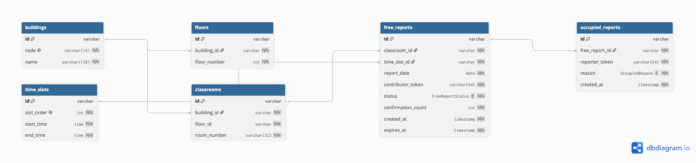

# SRM KTR Classroom Finder

Find free classrooms at **SRM Institute of Science and Technology, Kattankulathur (KTR)** between lecture periods. Students anonymously report empty rooms in **UB** and **Tech Park 2 (TP2)**. Tech Park 1 (TP1) exists as a campus building in the schema; classroom inventory for TP1 is deferred to V3. Classmates discover reports in real time — **no accounts, no OTP, no login**.

This repository is a DBMS coursework project: a production-style Next.js app on top of a **normalized PostgreSQL schema** with primary/foreign keys, CHECK constraints, composite keys, indexes, a SQL view, transactions, and aggregate queries.

> **Status:** Version 2 complete (V2.7 final QA). Production-ready with known limitations documented in [docs/QA-REPORT.md](docs/QA-REPORT.md).

See the [QA Report](docs/QA-REPORT.md) for the complete verification checklist.

---


## Features

- **Class Finder** — browse rooms free in the current (or selected) time slot via the `active_free_classrooms` view; filters, quick room search, live countdown, confidence badges, occupied reporting
- **Contributor** — multi-step wizard to report a free room; anonymous device token; daily soft caps and trust-weighted confirmation thresholds
- **Stats** — public dashboard of raw SQL aggregates (`GROUP BY`, `COUNT`, `AVG`, `HAVING`, `FILTER`, joins)
- **Auto-expiry** — Vercel Cron hits `/api/cron/expire` every 5 minutes to mark past-due free reports as `expired` (history retained)
- **PWA** — manifest, icons, and a versioned service worker (offline fallback; new deploys bump the cache name)
- **Hardening** — Zod env validation, API rate limiting, structured JSON logging, error/loading/404 pages, SEO + Open Graph
- **Help** — Contact, deterministic Classroom Finder assistant (live answers use the **same current-slot Finder query** unless the user asks about all slots), Community FAQ, mailto feedback
- **Admin** — private `/admin` inventory + report inspection (separate `ADMIN_SECRET`; public app stays anonymous)
- **Polish** — Framer Motion animations with `prefers-reduced-motion` support, dark mode via `next-themes`

---


## Tech stack


| Layer     | Choice                                                                        |
| --------- | ----------------------------------------------------------------------------- |
| Framework | Next.js 14 (App Router), TypeScript (strict)                                  |
| UI        | Tailwind CSS, shadcn/ui, Framer Motion, Sonner, Recharts                      |
| Database  | PostgreSQL 16                                                                 |
| ORM       | Prisma 6 (+ `$queryRaw` / `$transaction` where DBMS concepts must be visible) |
| Auth      | None — anonymous UUID device tokens (cookie + `localStorage`)                 |
| Deploy    | Vercel + Neon or Supabase Postgres                                            |
| Cron      | Vercel Cron → `GET /api/cron/expire`                                          |


---


## Folder structure

```text
SRM-Classroom-Finder/
├── app/                    # Next.js App Router (pages, API, layout, PWA manifest)
│   ├── api/cron/expire/    # Auto-expiry cron route
│   ├── contribute/         # Contributor wizard
│   ├── finder/             # Class Finder
│   ├── stats/              # Aggregate stats dashboard
│   └── …                   # error/loading/not-found, globals.css
├── components/             # UI: landing, finder, contribute, stats, shadcn/ui
├── docs/                   # DBMS deliverables (schema, ER, normalization, notes)
│   └── screenshots/        # Drop PNG/WebP captures here for the README gallery
├── hooks/                  # Client hooks (device token, media query)
├── lib/                    # Server data, actions, slots, env, rate limit, logging
├── prisma/
│   ├── schema.prisma       # Canonical data model
│   ├── seed.ts             # Buildings, floors, time slots
│   └── migrations/         # Versioned SQL (includes CHECKs + view)
├── public/                 # Static assets, PWA icons, service worker
├── scripts/                # Migration verify + phase smoke tests
├── docker-compose.yml      # Local Postgres
├── vercel.json             # Cron schedule
└── README.md
```

---


## Local setup


### Prerequisites

- Node.js 20+
- npm
- Docker (recommended for local Postgres) **or** a Neon/Supabase connection string


### 1. Clone and install

```bash
git clone <repo-url>
cd SRM-Classroom-Finder
npm install
cp .env.example .env
```


### 2. Environment variables

Edit `.env` (see [Environment variables](#environment-variables)). For Docker Postgres the defaults in `.env.example` already work.

### 3. Database

**Option A — Docker (recommended locally)**

```bash
docker compose up -d
npx prisma migrate deploy
npx prisma db seed
```

**Option B — Neon / Supabase**

1. Create a Postgres database.
2. Set `DATABASE_URL` in `.env` (include `?sslmode=require` when required).
3. Run:

```bash
npx prisma migrate deploy
npx prisma db seed
```


### 4. Run the app

```bash
npm run dev
```

Open [http://localhost:3000](http://localhost:3000).

---


## Environment variables


| Variable              | Required | Description                                                                                                                       |
| --------------------- | -------- | --------------------------------------------------------------------------------------------------------------------------------- |
| `DATABASE_URL`        | Yes      | PostgreSQL URL (`postgresql://` or `postgres://`). Validated at startup by Zod (`lib/env.ts`).                                    |
| `CRON_SECRET`         | Yes      | Bearer secret for `/api/cron/expire` (min 8 characters). Vercel Cron sends `Authorization: Bearer <CRON_SECRET>`.                 |
| `ADMIN_SECRET`        | Yes      | Server-only password for `/admin` (min 16 characters). **Not** `CRON_SECRET`. Never use `NEXT_PUBLIC_`.                            |
| `NEXT_PUBLIC_APP_URL` | No       | Canonical site origin for Open Graph / `metadataBase`. Defaults to `http://localhost:3000`. Set on Vercel to your production URL. |


Never commit real secrets. `.env` is gitignored; `.env.example` documents the contract.

---


## Database setup


### Prisma migration steps

From a clean machine (after `npm install` and a valid `DATABASE_URL`):

```bash
# Apply committed migrations to the database
npx prisma migrate deploy

# Generate the Prisma Client (also runs after migrate)
npx prisma generate

# Optional during local schema iteration only:
# npx prisma migrate dev
```

Useful scripts:

```bash
npm run db:migrate:deploy   # prisma migrate deploy
npm run db:generate         # prisma generate
npm run db:seed             # prisma db seed
npm run db:studio           # Prisma Studio browser
npm run db:verify-migration # Smoke-test migration on embedded Postgres
```


### Seed instructions

The seed is **idempotent** (safe to re-run):

```bash
npx prisma db seed
# or
npm run db:seed
```


| Entity     | Count | Notes                       |
| ---------- | ----- | --------------------------- |
| Buildings  | 3     | UB, TP1, TP2                |
| Floors     | 35    | UB 5–12, TP1 1–15, TP2 2–13 |
| Time slots | 10    | Campus periods 08:00–16:50  |
| Classrooms | 155   | Owner-verified UB (77) + TP2 (78). TP1 inventory deferred to V3. |


The seed writes **reference data only** (buildings, floors, slots, classroom inventory). It does **not** create free reports. Inventory means a room exists; Finder still requires a student `free_report`.

**DEVELOPMENT / DEMO ONLY** — synthetic Stats/Finder reports:

```bash
npx tsx scripts/seed-stats-data.ts
```

Never run that script against production. It is blocked when `NODE_ENV` or `VERCEL_ENV` is `production` unless you set `ALLOW_DEMO_STATS_SEED=true`. Demo rows are real database records and **will appear on Finder** while they remain active.

`npm run db:seed` does not invoke the demo script.


### Schema overview


| Table              | Role                                            |
| ------------------ | ----------------------------------------------- |
| `buildings`        | Campus buildings (rows, not enums)              |
| `floors`           | Floors per building                             |
| `time_slots`       | Period start/end times                          |
| `classrooms`       | Rooms — unique `(building, floor, room_number)` |
| `free_reports`     | Anonymous free-room claims                      |
| `occupied_reports` | Strike reports against a free claim             |
| `report_events`     | Append-only Still Free / confirmations (V2.2)   |


Also in migration SQL: CHECK constraints, composite FK (classroom floor ∈ building), indexes on Finder/cron hot paths, and view `active_free_classrooms`.

Full DDL for coursework: [docs/schema.sql](docs/schema.sql).

---


## Running locally

```bash
npm run dev      # http://localhost:3000
npm run build    # production build
npm run start    # serve production build
npm run lint     # ESLint
```


### Cron (local)

```bash
# CRON_SECRET must match .env
curl -sS -H "Authorization: Bearer $CRON_SECRET" \
  http://localhost:3000/api/cron/expire
```

Unauthorized → `401`. Rate-limited bursts → `429`.

---

## Admin (V2.6)

`/admin` is a private console. Public users stay anonymous — there is no student login.

- Set `ADMIN_SECRET` (min 16 characters, **not** `CRON_SECRET`, never `NEXT_PUBLIC_`).
- Sign-in sets an HttpOnly `SameSite=Lax` cookie (Secure in production, 8 hour expiry).
- Unauthenticated visits to `/admin`, `/admin/inventory`, and `/admin/reports` are redirected to `/admin/login` (middleware + server `requireAdmin()`).
- Inventory: activate / deactivate official classrooms only. Reports are not deleted.
- Report list shows one-way token fingerprints (`Token 7f3a91…`), never raw anonymous tokens.

---

## Help chat (live Finder)

The Contact assistant is deterministic (no LLM). Availability questions reuse `getFinderRefreshData` with the **same default as Class Finder** (current campus slot). Ask about “all slots” only when you want every active report. Secret probes (`CRON_SECRET`, `ADMIN_SECRET`, …) are refused without leaking values. Live questions are rate-limited.

Send feedback is a real `mailto:` link to `arthurknox007@gmail.com` (subject/body encoded; `@` in the address is not encoded). The browser may or may not open an OS mail client.

---


## Deployment (Vercel + Neon / Supabase)

1. **Database** — Create a Neon or Supabase Postgres project; copy the connection string.
2. **Vercel** — Import this repo; set env vars:
  - `DATABASE_URL`
  - `CRON_SECRET` (long random string)
  - `ADMIN_SECRET` (separate long random string for `/admin`)
  - `NEXT_PUBLIC_APP_URL` = `https://<your-vercel-domain>`
3. **Build** — Vercel runs `next build`. Ensure migrations run once against production:
  - Add a build/release step: `npx prisma migrate deploy && npx prisma generate`, **or**
  - Run `migrate deploy` + `db seed` locally against the production URL once.
4. **Cron** — `vercel.json` schedules `*/5 * * * `* on `/api/cron/expire`. Vercel injects the Authorization header using `CRON_SECRET` when configured for Cron Jobs.
Never run `scripts/seed-stats-data.ts` against production. It is **DEVELOPMENT / DEMO ONLY** and is blocked when `NODE_ENV` or `VERCEL_ENV` is `production`.

Local automated tests may leave fixture classrooms (`V22-…`, `V23-…`). Those are **not** official inventory. Reset them only on localhost:

```bash
npx tsx scripts/cleanup-local-test-fixtures.ts --yes
```

---


## PWA support

- Manifest: `/manifest.webmanifest` (`app/manifest.ts`)
- Icons: `/public/icons/` (192, 512, maskable, Apple touch)
- Service worker: `/public/sw.js` (cache name `srm-classroom-finder-v2.7`; network-first navigations; `/sw.js` is never cache-first; old caches deleted on activate)
- Register with `updateViaCache: "none"` so a new deploy can replace the worker
- Served over **HTTPS** (production) or **localhost**. Add-to-Home-Screen install prompts were not re-verified in this QA pass.

---


## Screenshots

### Landing Page


### Class Finder


### Contributor


### Stats Dashboard


---

## 🗂️ Entity Relationship Diagram


.png)

## DBMS Concepts Used


| Concept                         | Where it appears                                                               |
| ------------------------------- | ------------------------------------------------------------------------------ |
| Primary / foreign keys          | All tables; see `docs/schema.sql`                                              |
| Composite unique + composite FK | `floors(id, building_id)` ← `classrooms`                                       |
| CHECK constraints               | Floor > 0, slot end > start, non-blank tokens/rooms                            |
| Indexes                         | Finder/cron path `(report_date, time_slot_id, status)`, expiry, tokens         |
| VIEW                            | `active_free_classrooms` — Finder read model                                   |
| Transactions                    | Contribute upsert; occupied 2-strike hide (`prisma.$transaction`)              |
| Aggregates                      | Stats via `$queryRaw`: `GROUP BY`, `COUNT`, `AVG`, `HAVING`, `FILTER`          |
| 3NF design                      | Separate `buildings` / `floors` / `time_slots`; no redundant confidence column |


Coursework write-ups:

- [docs/schema.sql](docs/schema.sql) — full DDL
- [docs/ER-diagram.mmd](docs/ER-diagram.mmd) — Mermaid ER diagram
- [docs/ER-diagram.dbml](docs/ER-diagram.dbml) — DBML for [dbdiagram.io](https://dbdiagram.io)
- [docs/normalization-notes.md](docs/normalization-notes.md)
- [docs/dbms-report-notes.md](docs/dbms-report-notes.md)
- [docs/QA-REPORT.md](docs/QA-REPORT.md) — QA history including V2.7 final pass

---

## Version 2

| Release | What shipped |
|---------|----------------|
| **V2.1** | Authoritative classroom inventory; server-side building/floor/room validation; `is_active`; coverage-aware empty states. Inventory ≠ availability. TP1 rooms deferred. |
| **V2.2** | `report_events`; derived freshness/confidence; Still Free; separate Report Occupied; 2-strike hide; duplicate protection. |
| **V2.3** | Visibility-aware Finder polling (~20s / ~10s near expiry); Recently Reported; Ending Soon. |
| **V2.4** | Share + clipboard; human-readable deep links; local favorite buildings and recent rooms; How It Works. |
| **V2.5** | More Options; Contact; deterministic Chat; Community FAQ; mailto feedback. |
| **V2.6** | Demo-seed safeguards; live Finder answers in Chat; private `/admin` (`ADMIN_SECRET`); inventory activate/deactivate; token fingerprints. |
| **V2.7** | Chat uses Finder’s current-slot default; PWA cache versioning; timing-safe cron compare; skip link; documentation/QA freeze. |

Anonymous architecture is unchanged: no student accounts, OTP, or public login.

---

## Future improvements

- Redis/Upstash-backed rate limiting for multi-region Vercel isolates
- Optional campus map overlay for room locations
- Push notifications when a watched building gets a new free report
- pg_cron on managed Postgres as an alternative to Vercel Cron

---


## License

MIT © 2026 Nikhilesh Ganeshan & Sabrina — see `[LICENSE](LICENSE)`.

Built for an SRM KTR DBMS course project.