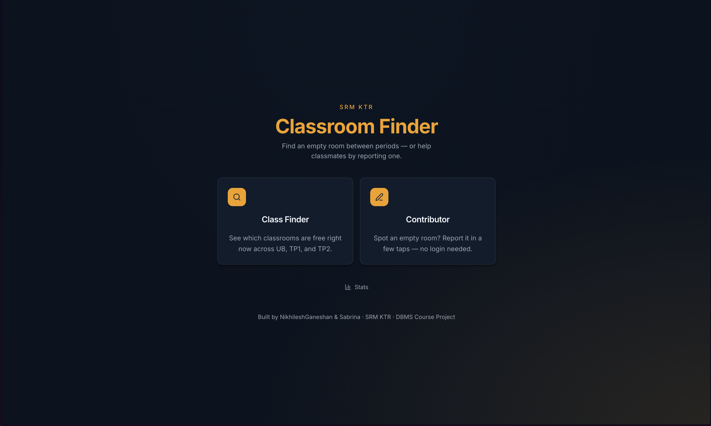
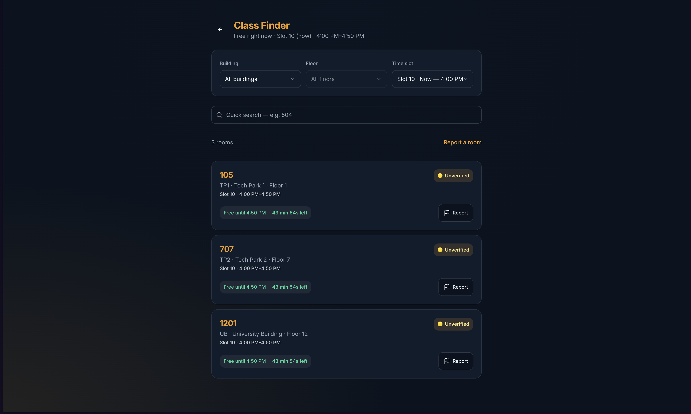
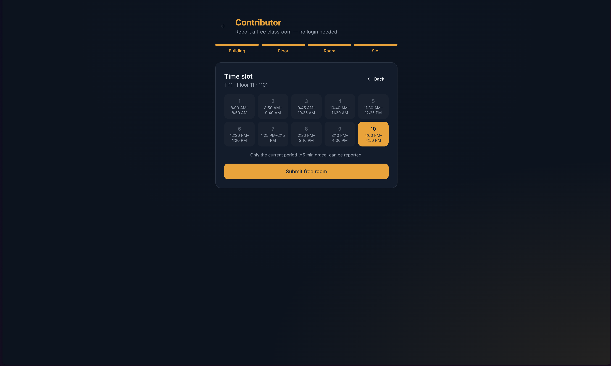
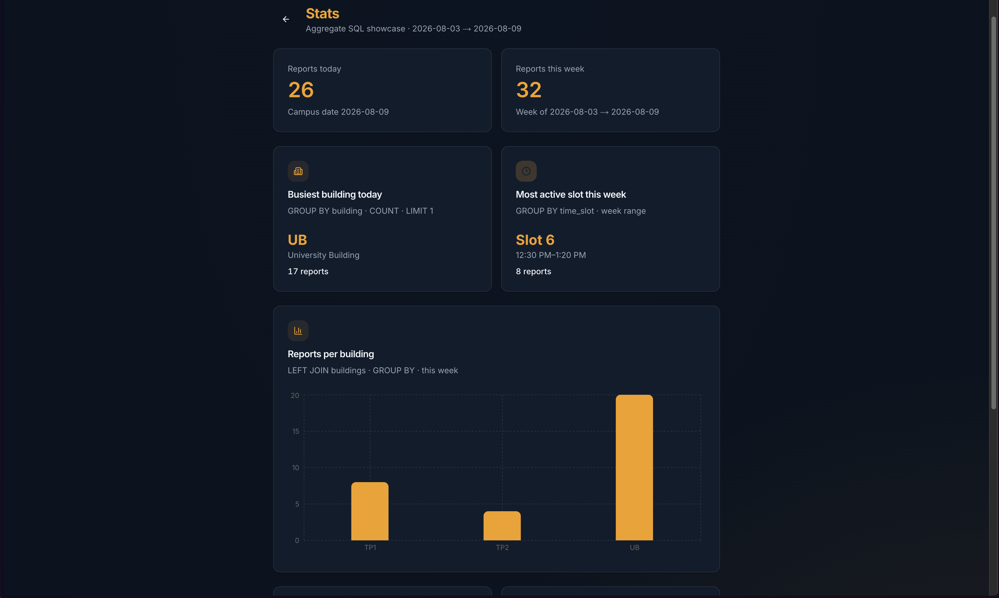

# SRM KTR Classroom Finder

Find free classrooms at **SRM Institute of Science and Technology, Kattankulathur (KTR)** between lecture periods. Students anonymously report empty rooms in UB, Tech Park 1 (TP1), and Tech Park 2 (TP2). Classmates discover them in real time — **no accounts, no OTP, no login**.

This repository is a DBMS coursework project: a production-style Next.js app on top of a **normalized PostgreSQL schema** with primary/foreign keys, CHECK constraints, composite keys, indexes, a SQL view, transactions, and aggregate queries.

---

## Features

- **Class Finder** — browse rooms free in the current (or selected) time slot via the `active_free_classrooms` view; filters, quick room search, live countdown, confidence badges, occupied reporting
- **Contributor** — multi-step wizard to report a free room; anonymous device token; daily soft caps and trust-weighted confirmation thresholds
- **Stats** — public dashboard of raw SQL aggregates (`GROUP BY`, `COUNT`, `AVG`, `HAVING`, `FILTER`, joins)
- **Auto-expiry** — Vercel Cron hits `/api/cron/expire` every 5 minutes to mark past-due free reports as `expired` (history retained)
- **PWA** — installable web app (manifest, icons, service worker)
- **Hardening** — Zod env validation, API rate limiting, structured JSON logging, error/loading/404 pages, SEO + Open Graph
- **Polish** — Framer Motion animations with `prefers-reduced-motion` support, dark mode via `next-themes`

---

## Tech stack

| Layer | Choice |
|--------|--------|
| Framework | Next.js 14 (App Router), TypeScript (strict) |
| UI | Tailwind CSS, shadcn/ui, Framer Motion, Sonner, Recharts |
| Database | PostgreSQL 16 |
| ORM | Prisma 6 (+ `$queryRaw` / `$transaction` where DBMS concepts must be visible) |
| Auth | None — anonymous UUID device tokens (cookie + `localStorage`) |
| Deploy | Vercel + Neon or Supabase Postgres |
| Cron | Vercel Cron → `GET /api/cron/expire` |

---

## Folder structure

```text
SRM-Classroom-Finder/
├── app/                    # Next.js App Router (pages, API, layout, PWA manifest)
│   ├── api/cron/expire/    # Auto-expiry cron route
│   ├── contribute/         # Contributor wizard
│   ├── finder/             # Class Finder
│   ├── stats/              # Aggregate stats dashboard
│   └── …                   # error/loading/not-found, globals.css
├── components/             # UI: landing, finder, contribute, stats, shadcn/ui
├── docs/                   # DBMS deliverables (schema, ER, normalization, notes)
│   └── screenshots/        # Drop PNG/WebP captures here for the README gallery
├── hooks/                  # Client hooks (device token, media query)
├── lib/                    # Server data, actions, slots, env, rate limit, logging
├── prisma/
│   ├── schema.prisma       # Canonical data model
│   ├── seed.ts             # Buildings, floors, time slots
│   └── migrations/         # Versioned SQL (includes CHECKs + view)
├── public/                 # Static assets, PWA icons, service worker
├── scripts/                # Migration verify + phase smoke tests
├── docker-compose.yml      # Local Postgres
├── vercel.json             # Cron schedule
└── README.md
```

---

## Local setup

### Prerequisites

- Node.js 20+
- npm
- Docker (recommended for local Postgres) **or** a Neon/Supabase connection string

### 1. Clone and install

```bash
git clone <repo-url>
cd SRM-Classroom-Finder
npm install
cp .env.example .env
```

### 2. Environment variables

Edit `.env` (see [Environment variables](#environment-variables)). For Docker Postgres the defaults in `.env.example` already work.

### 3. Database

**Option A — Docker (recommended locally)**

```bash
docker compose up -d
npx prisma migrate deploy
npx prisma db seed
```

**Option B — Neon / Supabase**

1. Create a Postgres database.
2. Set `DATABASE_URL` in `.env` (include `?sslmode=require` when required).
3. Run:

```bash
npx prisma migrate deploy
npx prisma db seed
```

### 4. Run the app

```bash
npm run dev
```

Open [http://localhost:3000](http://localhost:3000).

---

## Environment variables

| Variable | Required | Description |
|----------|----------|-------------|
| `DATABASE_URL` | Yes | PostgreSQL URL (`postgresql://` or `postgres://`). Validated at startup by Zod (`lib/env.ts`). |
| `CRON_SECRET` | Yes | Bearer secret for `/api/cron/expire` (min 8 characters). Vercel Cron sends `Authorization: Bearer <CRON_SECRET>`. |
| `NEXT_PUBLIC_APP_URL` | No | Canonical site origin for Open Graph / `metadataBase`. Defaults to `http://localhost:3000`. Set on Vercel to your production URL. |

Never commit real secrets. `.env` is gitignored; `.env.example` documents the contract.

---

## Database setup

### Prisma migration steps

From a clean machine (after `npm install` and a valid `DATABASE_URL`):

```bash
# Apply committed migrations to the database
npx prisma migrate deploy

# Generate the Prisma Client (also runs after migrate)
npx prisma generate

# Optional during local schema iteration only:
# npx prisma migrate dev
```

Useful scripts:

```bash
npm run db:migrate:deploy   # prisma migrate deploy
npm run db:generate         # prisma generate
npm run db:seed             # prisma db seed
npm run db:studio           # Prisma Studio browser
npm run db:verify-migration # Smoke-test migration on embedded Postgres
```

### Seed instructions

The seed is **idempotent** (safe to re-run):

```bash
npx prisma db seed
# or
npm run db:seed
```

| Entity | Count | Notes |
|--------|-------|-------|
| Buildings | 3 | UB, TP1, TP2 |
| Floors | 35 | UB 5–12, TP1 1–15, TP2 2–13 |
| Time slots | 10 | Campus periods 08:00–16:50 |

Optional demo data for Stats charts:

```bash
npx tsx scripts/seed-stats-data.ts
```

### Schema overview

| Table | Role |
|-------|------|
| `buildings` | Campus buildings (rows, not enums) |
| `floors` | Floors per building |
| `time_slots` | Period start/end times |
| `classrooms` | Rooms — unique `(building, floor, room_number)` |
| `free_reports` | Anonymous free-room claims |
| `occupied_reports` | Strike reports against a free claim |

Also in migration SQL: CHECK constraints, composite FK (classroom floor ∈ building), indexes on Finder/cron hot paths, and view `active_free_classrooms`.

Full DDL for coursework: [`docs/schema.sql`](docs/schema.sql).

---

## Running locally

```bash
npm run dev      # http://localhost:3000
npm run build    # production build
npm run start    # serve production build
npm run lint     # ESLint
```

### Cron (local)

```bash
# CRON_SECRET must match .env
curl -sS -H "Authorization: Bearer $CRON_SECRET" \
  http://localhost:3000/api/cron/expire
```

Unauthorized → `401`. Rate-limited bursts → `429`.

---

## Deployment (Vercel + Neon / Supabase)

1. **Database** — Create a Neon or Supabase Postgres project; copy the connection string.
2. **Vercel** — Import this repo; set env vars:
   - `DATABASE_URL`
   - `CRON_SECRET` (long random string)
   - `NEXT_PUBLIC_APP_URL` = `https://<your-vercel-domain>`
3. **Build** — Vercel runs `next build`. Ensure migrations run once against production:
   - Add a build/release step: `npx prisma migrate deploy && npx prisma generate`, **or**
   - Run `migrate deploy` + `db seed` locally against the production URL once.
4. **Cron** — `vercel.json` schedules `*/5 * * * *` on `/api/cron/expire`. Vercel injects the Authorization header using `CRON_SECRET` when configured for Cron Jobs.
5. **Seed** — Run `npx prisma db seed` against production once so buildings/floors/slots exist.

---

## PWA support

- Manifest: `/manifest.webmanifest` (`app/manifest.ts`)
- Icons: `/public/icons/` (192, 512, maskable, Apple touch)
- Service worker: `/public/sw.js` (registered by `PwaRegister`)
- Installable on **HTTPS** (production) or **localhost**

---

## Screenshots

Add captures under [`docs/screenshots/`](docs/screenshots/) using the filenames below, then they appear in GitHub/README renders.

| File | Screen |
|------|--------|
| `docs/screenshots/landing.png` | Landing — Class Finder + Contributor cards |
| `docs/screenshots/finder.png` | Class Finder — filters, cards, countdown |
| `docs/screenshots/contribute.png` | Contributor wizard |
| `docs/screenshots/stats.png` | Stats dashboard + bar chart |
| `docs/screenshots/mobile.png` | Mobile viewport (optional) |

```markdown




```

---

## DBMS Concepts Used

| Concept | Where it appears |
|---------|------------------|
| Primary / foreign keys | All tables; see `docs/schema.sql` |
| Composite unique + composite FK | `floors(id, building_id)` ← `classrooms` |
| CHECK constraints | Floor &gt; 0, slot end &gt; start, non-blank tokens/rooms |
| Indexes | Finder/cron path `(report_date, time_slot_id, status)`, expiry, tokens |
| VIEW | `active_free_classrooms` — Finder read model |
| Transactions | Contribute upsert; occupied 2-strike hide (`prisma.$transaction`) |
| Aggregates | Stats via `$queryRaw`: `GROUP BY`, `COUNT`, `AVG`, `HAVING`, `FILTER` |
| 3NF design | Separate `buildings` / `floors` / `time_slots`; no redundant confidence column |

Coursework write-ups:

- [`docs/schema.sql`](docs/schema.sql) — full DDL
- [`docs/ER-diagram.mmd`](docs/ER-diagram.mmd) — Mermaid ER diagram
- [`docs/ER-diagram.dbml`](docs/ER-diagram.dbml) — DBML for [dbdiagram.io](https://dbdiagram.io)
- [`docs/normalization-notes.md`](docs/normalization-notes.md)
- [`docs/dbms-report-notes.md`](docs/dbms-report-notes.md)

---

## Future improvements

- Redis/Upstash-backed rate limiting for multi-region Vercel isolates
- Optional campus map overlay for room locations
- Push notifications when a watched building gets a new free report
- Admin moderation tools (still without end-user accounts)
- pg_cron on managed Postgres as an alternative to Vercel Cron

---

## License

MIT © NikhileshGaneshan & Sabrina — see [`LICENSE`](LICENSE).

Built for an SRM KTR DBMS course project.
