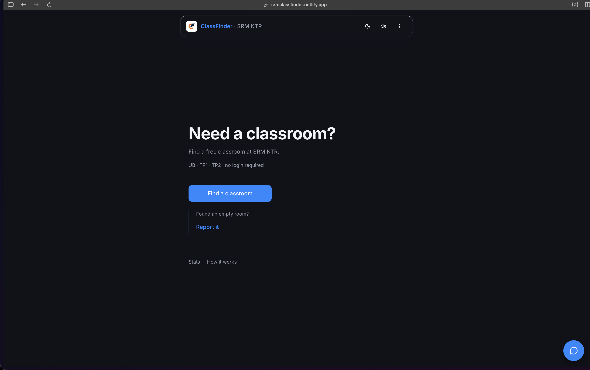
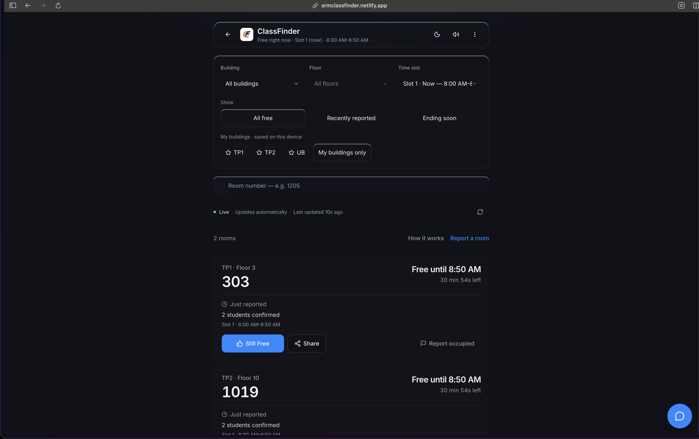
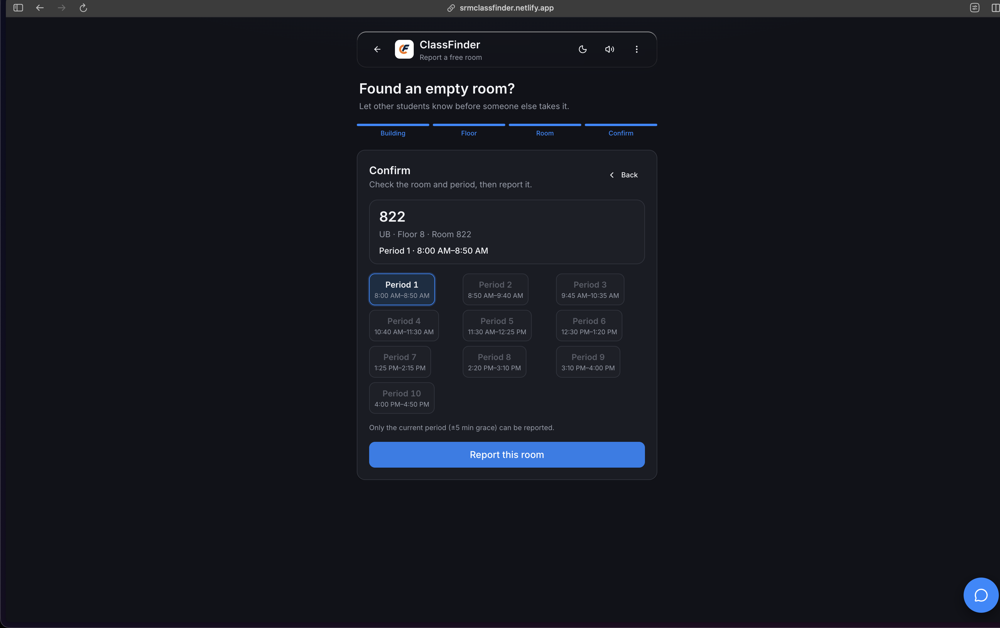
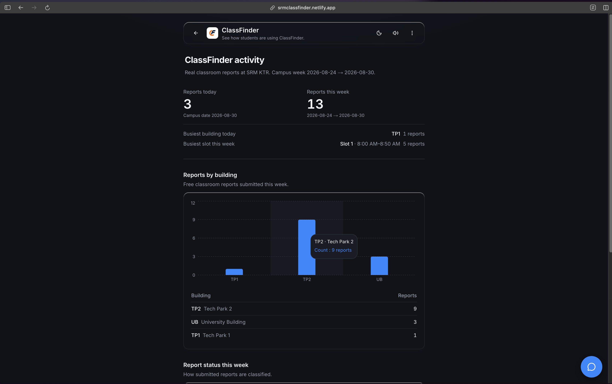
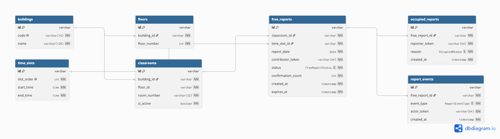

# SRM KTR Classroom Finder

Find free classrooms at **SRM Institute of Science and Technology, Kattankulathur (KTR)** between lecture periods. Students anonymously report empty rooms in **UB**, **Tech Park 1 (TP1)**, and **Tech Park 2 (TP2)**. Classmates discover reports in real time — **no accounts, no OTP, no login**.

This repository is a DBMS coursework project: a production-style Next.js app on top of a **normalized PostgreSQL schema** with primary/foreign keys, CHECK constraints, composite keys, indexes, a SQL view, transactions, and aggregate queries.

> **Status:** Version 5 complete (`v5-final`). Deployed to **Netlify**. Earlier QA passes are archived in [docs/QA-REPORT.md](docs/QA-REPORT.md) (V5 QA status is documented there; formal sign-off is still pending).

---

## Features

### Core (V1–V2)

- **Class Finder** — browse rooms free in the current (or selected) time slot via the `active_free_classrooms` view; filters, quick room search, live countdown, confidence badges, occupied reporting
- **Contributor** — multi-step wizard to report a free room; anonymous device token; daily soft caps and trust-weighted confirmation thresholds
- **Stats** — public dashboard of raw SQL aggregates (`GROUP BY`, `COUNT`, `AVG`, `HAVING`, `FILTER`, joins)
- **Auto-expiry** — scheduled HTTP job hits `/api/cron/expire` every 5 minutes to mark past-due free reports as `expired` (history retained)
- **PWA** — manifest, icons, and a versioned service worker (offline fallback)
- **Hardening** — Zod env validation, API rate limiting, structured JSON logging, error/loading/404 pages, SEO + Open Graph
- **Help** — Contact, deterministic ClassFinder assistant (live answers use the **same current-slot Finder query** unless the user asks about all slots), Community FAQ, mailto feedback
- **Admin** — private `/admin` console (separate `ADMIN_SECRET`; public app stays anonymous)
- **Polish** — Framer Motion animations with `prefers-reduced-motion` support, dark mode via `next-themes`

### V3 — ClassFinder redesign

- **Design system** — semantic tokens, liquid-glass surfaces, updated typography and spacing (`app/globals.css`, `components/glass/`)
- **Boot sequence** — one-time ClassFinder loading identity on first visit (`components/classfinder-loading.tsx`)
- **Global Help launcher** — floating ClassFinder Help on public routes (`components/help/classfinder-help-global.tsx`)
- **How It Works** — guided explanation at `/how-it-works`
- **Performance** — catalog caching for dimension data (`lib/catalog-cache.ts`); lighter glass on small screens

### V4 — Easter Egg and admin changes

- **IST clock windows** — morning, evening, night, and normal phases (`lib/easter-egg.ts`)
- **Contributor gates** — evening/night Easter Egg screens block the reporting wizard (`components/contribute/contribute-gate.tsx`)
- **Daily reporting cycle** — campus-day boundaries for report eligibility
- **Admin inventory UI removed** — classroom catalog changes are seed/DB operations only; admin is read-only for inventory

### V5 — Operations, sound, and XO Easter Egg

- **Admin Operations center** — `/admin/operations` health, integrity checks, and recent activity (`lib/admin/operations.ts`)
- **TP1 classroom inventory** — 88 owner-verified TP1 rooms added to seed data (`prisma/data/classroom-inventory.ts`)
- **UI sounds** — optional Web Audio synthesis for clicks and feedback (`lib/sound-effects.ts`, `components/sound/`)
- **XO Easter Egg** — tic-tac-toe mini-game (`components/easter-egg/`, `lib/xo-game.ts`)
- **Brand components** — ClassFinder logo and nav title (`components/brand/`, `public/brand/`)

---

## Tech stack

| Layer     | Choice                                                                        |
| --------- | ----------------------------------------------------------------------------- |
| Framework | Next.js 14 (App Router), TypeScript (strict)                                  |
| UI        | Tailwind CSS, shadcn/ui, Framer Motion, Sonner, Recharts                      |
| Database  | PostgreSQL 16                                                                 |
| ORM       | Prisma 6 (+ `$queryRaw` / `$transaction` where DBMS concepts must be visible) |
| Auth      | None — anonymous UUID device tokens (cookie + `localStorage`)                 |
| Deploy    | **Netlify** + Neon or Supabase Postgres                                       |
| Cron      | Scheduled HTTP → `GET /api/cron/expire` with `Authorization: Bearer <CRON_SECRET>` |

> A legacy `vercel.json` cron definition remains in the repo from an earlier deployment target. Production cron is configured on **Netlify** (exact schedule/UI settings are not checked into this repository).

---

## Folder structure

```text
SRM-Classroom-Finder/
├── app/                         # Next.js App Router
│   ├── admin/                   # Private admin console (login + Overview / Operations / Reports)
│   ├── api/
│   │   ├── cron/expire/         # Auto-expiry cron route
│   │   └── finder/              # Finder poll API
│   ├── contact/                 # Contact, Help chat, Community FAQ
│   ├── contribute/              # Contributor wizard (+ Easter Egg gates)
│   ├── finder/                  # Class Finder
│   ├── how-it-works/            # Guided explanation
│   ├── stats/                   # Aggregate stats dashboard
│   └── …                        # layout, manifest, error/loading/not-found, globals.css
├── components/
│   ├── admin/                   # Admin panels and nav
│   ├── brand/                   # ClassFinder logo and titles
│   ├── contact/                 # Contact and FAQ UI
│   ├── contribute/              # Contributor wizard and gates
│   ├── easter-egg/              # XO Easter Egg dialog and game
│   ├── finder/                  # Finder board, filters, cards
│   ├── glass/                   # Liquid-glass surfaces (V3)
│   ├── help/                    # Global Help launcher and chat panel
│   ├── sound/                   # Sound provider and toggles (V5)
│   ├── stats/                   # Stats dashboard
│   ├── theme/                   # Theme toggle
│   └── ui/                      # shadcn/ui primitives
├── docs/                        # DBMS deliverables, QA report, screenshots
├── hooks/                       # Client hooks (polling, sound, media query)
├── lib/                         # Server data, actions, slots, env, admin, help
│   └── admin/                   # Admin session, operations, report data
├── prisma/
│   ├── data/                    # Owner-verified classroom inventory
│   ├── schema.prisma            # Canonical data model
│   ├── seed.ts                  # Buildings, floors, slots, classrooms
│   └── migrations/              # Versioned SQL (CHECKs + view)
├── public/
│   ├── brand/                   # ClassFinder logo assets
│   ├── icons/                   # PWA icons
│   └── sw.js                    # Service worker
├── scripts/                     # Migration verify + phase smoke tests
├── docker-compose.yml           # Local Postgres
├── vercel.json                  # Legacy Vercel cron schedule (see Tech stack)
└── README.md
```

---

## Local setup

### Prerequisites

- Node.js 20+
- npm
- Docker (recommended for local Postgres) **or** a Neon/Supabase connection string

### 1. Clone and install

```bash
git clone <repo-url>
cd SRM-Classroom-Finder
npm install
cp .env.example .env
```

### 2. Environment variables

Edit `.env` (see [Environment variables](#environment-variables)). For Docker Postgres the defaults in `.env.example` already work.

### 3. Database

**Option A — Docker (recommended locally)**

```bash
docker compose up -d
npx prisma migrate deploy
npx prisma db seed
```

**Option B — Neon / Supabase**

1. Create a Postgres database.
2. Set `DATABASE_URL` in `.env` (include `?sslmode=require` when required).
3. Run:

```bash
npx prisma migrate deploy
npx prisma db seed
```

### 4. Run the app

```bash
npm run dev
```

Open [http://localhost:3000](http://localhost:3000).

---

## Environment variables

| Variable              | Required | Description                                                                                                                       |
| --------------------- | -------- | --------------------------------------------------------------------------------------------------------------------------------- |
| `DATABASE_URL`        | Yes      | PostgreSQL URL (`postgresql://` or `postgres://`). Validated at startup by Zod (`lib/env.ts`).                                    |
| `CRON_SECRET`         | Yes      | Bearer secret for `/api/cron/expire` (min 8 characters). Cron scheduler must send `Authorization: Bearer <CRON_SECRET>`.          |
| `ADMIN_SECRET`        | Yes      | Server-only password for `/admin` (min 16 characters). **Not** `CRON_SECRET`. Never use `NEXT_PUBLIC_`.                            |
| `NEXT_PUBLIC_APP_URL` | No       | Canonical site origin for Open Graph / `metadataBase`. Defaults to `http://localhost:3000`. Set in production to your public URL. |

Never commit real secrets. `.env` is gitignored; `.env.example` documents the contract.

---

## Database setup

### Prisma migration steps

From a clean machine (after `npm install` and a valid `DATABASE_URL`):

```bash
# Apply committed migrations to the database
npx prisma migrate deploy

# Generate the Prisma Client (also runs via prebuild on npm run build)
npx prisma generate

# Optional during local schema iteration only:
# npx prisma migrate dev
```

Useful scripts:

```bash
npm run db:migrate:deploy   # prisma migrate deploy
npm run db:generate         # prisma generate
npm run db:seed             # prisma db seed
npm run db:studio           # Prisma Studio browser
npm run db:verify-migration # Smoke-test migration on embedded Postgres
```

### Seed instructions

The seed is **idempotent** (safe to re-run):

```bash
npx prisma db seed
# or
npm run db:seed
```

| Entity     | Count | Notes                                        |
| ---------- | ----- | -------------------------------------------- |
| Buildings  | 3     | UB, TP1, TP2                                 |
| Floors     | 35    | UB 5–12, TP1 1–15, TP2 2–13                  |
| Time slots | 10    | Campus periods 08:00–16:50                   |
| Classrooms | 243   | Owner-verified UB (77) + TP1 (88) + TP2 (78) |

The seed writes **reference data only** (buildings, floors, slots, classroom inventory). It does **not** create free reports. Inventory means a room exists; Finder still requires a student `free_report`.

**DEVELOPMENT / DEMO ONLY** — synthetic Stats/Finder reports:

```bash
npx tsx scripts/seed-stats-data.ts
```

Never run that script against production. It is blocked when `NODE_ENV` or `VERCEL_ENV` is `production` unless you set `ALLOW_DEMO_STATS_SEED=true`. Demo rows are real database records and **will appear on Finder** while they remain active.

`npm run db:seed` does not invoke the demo script.

### Schema overview

| Table              | Role                                            |
| ------------------ | ----------------------------------------------- |
| `buildings`        | Campus buildings (rows, not enums)              |
| `floors`           | Floors per building                             |
| `time_slots`       | Period start/end times                          |
| `classrooms`       | Rooms — unique `(building, floor, room_number)` |
| `free_reports`     | Anonymous free-room claims                      |
| `occupied_reports` | Strike reports against a free claim             |
| `report_events`    | Append-only Still Free / confirmations (V2.2)   |

Also in migration SQL: CHECK constraints, composite FK (classroom floor ∈ building), indexes on Finder/cron hot paths, and view `active_free_classrooms`.

Full DDL for coursework: [docs/schema.sql](docs/schema.sql).

---

## Running locally

```bash
npm run dev      # http://localhost:3000
npm run build    # production build (runs prisma generate via prebuild)
npm run start    # serve production build
npm run lint     # ESLint
```

### Cron (local)

```bash
# CRON_SECRET must match .env
curl -sS -H "Authorization: Bearer $CRON_SECRET" \
  http://localhost:3000/api/cron/expire
```

Unauthorized → `401`. Rate-limited bursts → `429`.

---

## Admin

`/admin` is a private console. Public users stay anonymous — there is no student login.

- Set `ADMIN_SECRET` (min 16 characters, **not** `CRON_SECRET`, never `NEXT_PUBLIC_`).
- Sign-in sets an HttpOnly `SameSite=Lax` cookie (Secure in production, 8 hour expiry).
- Unauthenticated visits to `/admin`, `/admin/operations`, and `/admin/reports` are redirected to `/admin/login` (middleware + server `requireAdmin()`).

### Sections

| Route | Purpose |
| ----- | ------- |
| `/admin` | Overview — report and inventory **metrics** (read-only) |
| `/admin/operations` | Operations center — system health, integrity checks, recent activity (V5) |
| `/admin/reports` | Report inspection — token fingerprints only (`Token 7f3a91…`), never raw device tokens |

**Inventory changes:** there is no in-app inventory editor (removed in V4). Update `prisma/data/classroom-inventory.ts` and re-run `npm run db:seed`, or apply direct DB changes. Reports are not deleted from the admin UI.

---

## Help chat (live Finder)

The Contact assistant is deterministic (no LLM). Availability questions reuse `getFinderRefreshData` with the **same default as Class Finder** (current campus slot). Ask about “all slots” only when you want every active report. Secret probes (`CRON_SECRET`, `ADMIN_SECRET`, …) are refused without leaking values. Live questions are rate-limited.

A **global Help launcher** is also available on public routes (not `/admin`).

Send feedback is a real `mailto:` link to `arthurknox007@gmail.com` (subject/body encoded; `@` in the address is not encoded). The browser may or may not open an OS mail client.

---

## Deployment (Netlify + Neon / Supabase)

Production is hosted on **Netlify**. Exact site URL and scheduled-function configuration are managed in the Netlify dashboard and are **not checked into this repository**.

1. **Database** — Create a Neon or Supabase Postgres project; copy the connection string.
2. **Netlify** — Connect this repo; set environment variables:
   - `DATABASE_URL`
   - `CRON_SECRET` (long random string)
   - `ADMIN_SECRET` (separate long random string for `/admin`)
   - `NEXT_PUBLIC_APP_URL` = your public Netlify URL
3. **Build** — Netlify runs `npm run build` (which triggers `prisma generate` via `prebuild`). Run migrations once against production:
   - `npx prisma migrate deploy` from CI or locally against the production URL, **and**
   - `npx prisma db seed` once for reference data.
4. **Cron** — Configure a Netlify scheduled function or external scheduler to `GET /api/cron/expire` every 5 minutes with header `Authorization: Bearer <CRON_SECRET>`. The legacy `vercel.json` schedule (`*/5 * * * *`) documents the intended interval but applies only if deployed on Vercel.

Never run `scripts/seed-stats-data.ts` against production. It is **DEVELOPMENT / DEMO ONLY** and is blocked when `NODE_ENV` or `VERCEL_ENV` is `production`.

Local automated tests may leave fixture classrooms (`V22-…`, `V23-…`). Those are **not** official inventory. Reset them only on localhost:

```bash
npx tsx scripts/cleanup-local-test-fixtures.ts --yes
```

---

## PWA support

- Manifest: `/manifest.webmanifest` (`app/manifest.ts`)
- Icons: `/public/icons/` (192, 512, maskable, Apple touch)
- Service worker: `/public/sw.js` (cache name `srm-classroom-finder-v2.7`; network-first navigations; `/sw.js` is never cache-first; old caches deleted on activate)
- Register with `updateViaCache: "none"` so a new deploy can replace the worker
- Served over **HTTPS** (production) or **localhost**

---

## Screenshots

### Landing Page



### Class Finder



### Contributor



### Stats Dashboard



---

## Entity Relationship Diagram


.png)

## DBMS Concepts Used

| Concept                         | Where it appears                                                               |
| ------------------------------- | ------------------------------------------------------------------------------ |
| Primary / foreign keys          | All tables; see `docs/schema.sql`                                              |
| Composite unique + composite FK | `floors(id, building_id)` ← `classrooms`                                       |
| CHECK constraints               | Floor > 0, slot end > start, non-blank tokens/rooms                            |
| Indexes                         | Finder/cron path `(report_date, time_slot_id, status)`, expiry, tokens         |
| VIEW                            | `active_free_classrooms` — Finder read model                                   |
| Transactions                    | Contribute upsert; occupied 2-strike hide (`prisma.$transaction`)              |
| Aggregates                      | Stats via `$queryRaw`: `GROUP BY`, `COUNT`, `AVG`, `HAVING`, `FILTER`          |
| 3NF design                      | Separate `buildings` / `floors` / `time_slots`; no redundant confidence column |

Coursework write-ups:

- [docs/schema.sql](docs/schema.sql) — full DDL
- [docs/ER-diagram.mmd](docs/ER-diagram.mmd) — Mermaid ER diagram
- [docs/ER-diagram.dbml](docs/ER-diagram.dbml) — DBML for [dbdiagram.io](https://dbdiagram.io)
- [docs/normalization-notes.md](docs/normalization-notes.md)
- [docs/dbms-report-notes.md](docs/dbms-report-notes.md)
- [docs/QA-REPORT.md](docs/QA-REPORT.md) — QA history (V5 status pending sign-off; V2.7 and Phase 14 archived below)

---

## Version history

The project shipped in five major versions. Confirmed phase counts: **V1 = 13**, **V2 = 6**, **V3 = 8**, **V4 = 12**, **V5 = 13**. Individual phase names and per-phase scopes are listed below **only when documented in this repository**; all others are marked *undocumented*.

### V1 — 13 phases

Git commit messages name development phases **4, 6, 7, 8, 10, 11, 12, and 13**. Phases **1, 2, 3, 5, and 9** have no named commits. How repository artifacts map to all **13** confirmed V1 phases is *undocumented*.

The repository also contains a **Phase 14 final QA** artifact (`docs/QA-REPORT.md`, git commit “Phase 14 - Final QA and production readiness”). That is historical final verification documentation — **not** an additional V1 development phase. V1 remains **13 phases**.

Repository-evidenced deliverables (from named development-phase commits and the Phase 14 QA report): anonymous device token, Class Finder, report modal with 2-strike auto-hide, auto-expiry cron, Stats dashboard, PWA hardening, UI polish, DBMS documentation package, final QA harness.

### V2 — 6 phases

All **6** confirmed V2 phase names and per-phase scopes are *undocumented* in this repository.

The repository also contains **seven** git sub-release commit messages (V2.1–V2.7). These are release identifiers, not a confirmed phase list, and their mapping to the **6** V2 phases is *undocumented*.

| Sub-release (git) | Documented scope (from prior README / git) |
| ----------------- | -------------------------------------------- |
| V2.1 | Authoritative classroom inventory; server-side building/floor/room validation; `is_active`; coverage-aware empty states. Inventory ≠ availability. TP1 rooms deferred at this release. |
| V2.2 | `report_events`; derived freshness/confidence; Still Free; separate Report Occupied; 2-strike hide; duplicate protection. |
| V2.3 | Visibility-aware Finder polling (~20s / ~10s near expiry); Recently Reported; Ending Soon. |
| V2.4 | Share + clipboard; human-readable deep links; local favorite buildings and recent rooms; How It Works page introduced. |
| V2.5 | More Options; Contact; deterministic Chat; Community FAQ; mailto feedback. |
| V2.6 | Demo-seed safeguards; live Finder answers in Chat; private `/admin` (`ADMIN_SECRET`); inventory activate/deactivate; token fingerprints. |
| V2.7 | Chat uses Finder’s current-slot default; PWA cache versioning; timing-safe cron compare; skip link; documentation/QA freeze. |

Anonymous architecture is unchanged across V2: no student accounts, OTP, or public login.

### V3 — 8 phases

All **8** confirmed V3 phase names and per-phase scopes are *undocumented* in this repository.

Git release commit: **“V3.0 - ClassFinder redesign and performance.”** Repository-evidenced scope (not a phase list): design system and glass UI, boot sequence, global Help launcher, admin console shell refresh, performance/caching work. See [Features → V3](#v3--classfinder-redesign).

### V4 — 12 phases

All **12** confirmed V4 phase names and per-phase scopes are *undocumented* in this repository.

Git release commit: **“Release V4.0.0.”** Repository-evidenced scope (not a phase list): Easter Egg IST clock windows and Contributor gates; removal of admin inventory mutation UI; catalog caching; DB error classification; report-integrity helpers. See [Features → V4](#v4--easter-egg-and-admin-changes).

### V5 — 13 phases

**9** of the **13** confirmed V5 phases are *undocumented* in this repository (phases **2, 5, 7, 8, 9, 10, 11, 12, and 13**).

| Phase | Source | Documented scope |
| ----- | ------ | ---------------- |
| 1 | git commit | Admin Operations center (`/admin/operations`) |
| 2 | — | *undocumented* |
| 3 / 3.1 | test script | XO Easter Egg game logic and unlock |
| 4 | test script | UI sound synthesis system |
| 5 | — | *undocumented* |
| 6 / 6.1 / 6.2 | test scripts | Easter Egg entry actions, XO close navigation, UI polish, fair XO AI |
| 7–13 | — | *undocumented* |

Git release commit **“feat: complete V5 release”** also added TP1 inventory (88 rooms), brand components, and broad UI integration across the app.

---

## Future improvements

- Redis/Upstash-backed rate limiting for multi-region serverless isolates
- Optional campus map overlay for room locations
- Push notifications when a watched building gets a new free report
- pg_cron on managed Postgres as an alternative to HTTP cron
- Update `docs/QA-REPORT.md` for V5 final QA
- Bump PWA service-worker cache version to match V5

---

## License

MIT © 2026 Nikhilesh Ganeshan & Sabrina — see [LICENSE](LICENSE).

Built for an SRM KTR DBMS course project.
